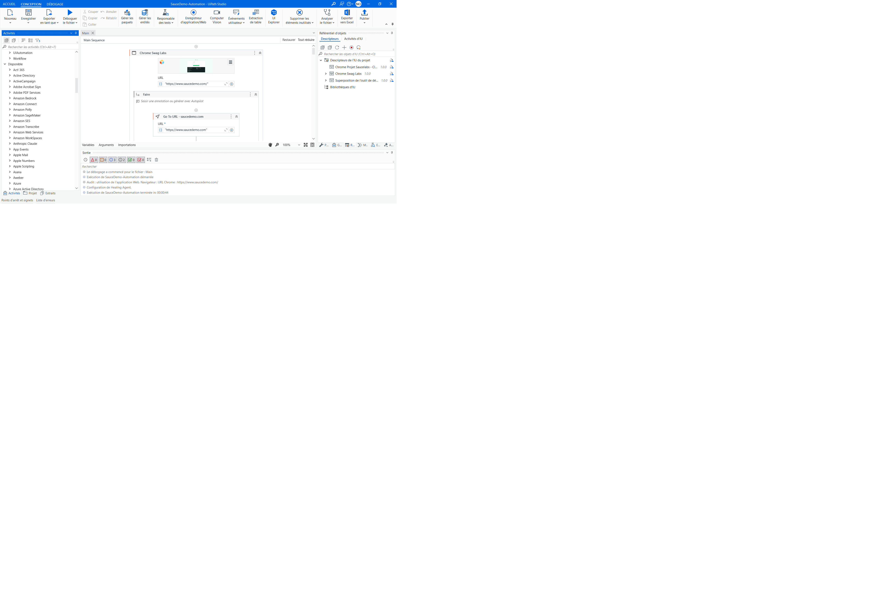
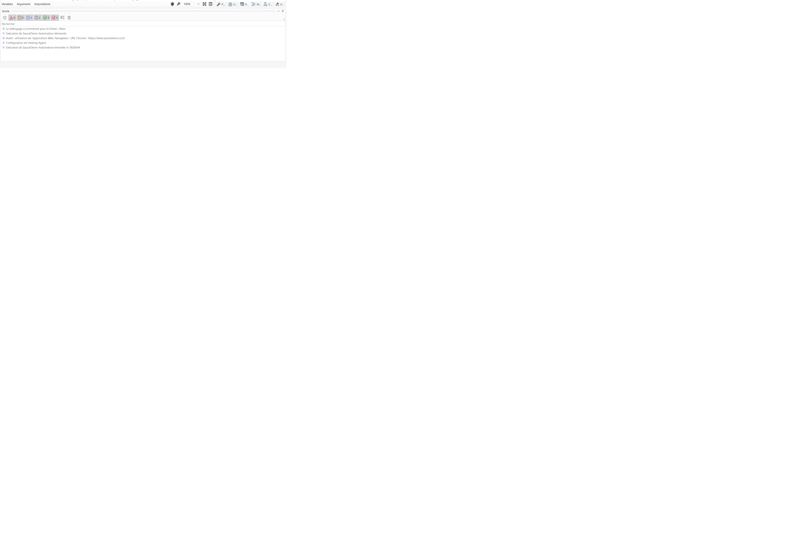

# UiPath RPA - SauceDemo Automation

Projet d'automatisation RPA avec UiPath Studio sur l'application de démonstration [Sauce Demo](https://www.saucedemo.com).

## Stack technique

- **UiPath Studio** 2024.10 Community Edition
- **UiPath Automation Cloud** (Orchestrator)
- **Chrome** avec extension UiPath

## Workflow automatisé

Le processus automatise un parcours e-commerce complet en 44 secondes :

1. Navigation vers saucedemo.com
2. Login (standard_user)
3. Ajout du Sauce Labs Backpack au panier
4. Checkout avec informations de livraison
5. Confirmation de commande
6. Retour à l'accueil

## Structure du projet

- `Main.xaml` — workflow principal (Use Application/Browser, Type Into, Click)
- `screenshots/` — captures d'écran du workflow et des résultats

## Screenshots

### Workflow UiPath Studio

### Logs d'exécution

## Résultat

Exécution terminée sans erreur en **00:00:44**